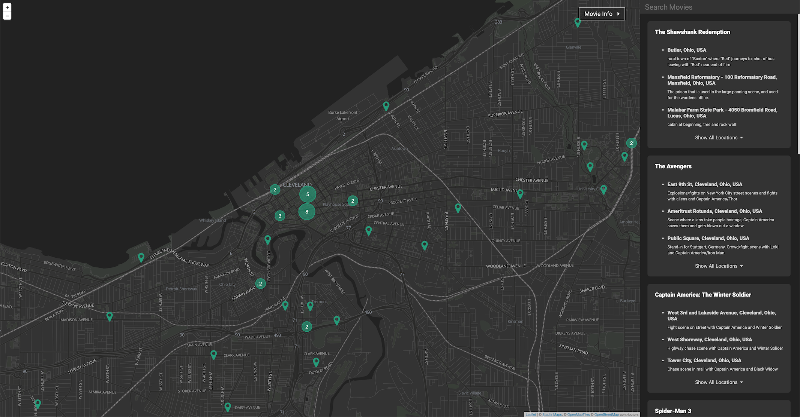

# Film Locations

Interactive map of filming locations around the world. Built with a Node backend and React frontend, with [Leafletjs](https://leafletjs.com/) for the interactive map.

## Installation

This project is built around [docker](https://www.docker.com/products/docker-desktop), but can be run without it.

### Database

The database setup/connection info is handled through docker configuration.
If you are running a database outside of docker check the environment variables in `docker-compose.yml` for the container `film_locations` to see what environment variables need to be set.

To initialize the database start the `mongodb` docker image with `docker-compose up -d mongodb`.
To connect to the MongoDB database running in docker.
`docker-compose run mongodb mongo --host mongodb --username film_locations_user --password film_locations_pass --authenticationDatabase admin film_locations`

To generate the database run `docker-compose run --rm get_film_locations`.
This requires a connection to [Google's Geocoding API](https://developers.google.com/maps/documentation/geocoding/intro) which can be configured in `credentials/google.json`.
This is not a free API, so be aware of billing before running. There will be around 100,000 requests made to it.
In the future I'm planning to add some test data so that this script doesn't need to run.

### Cache

The redis cache is similar to the database; the setup and connection is handled through docker configuration.
Same as the database, if you are running redis outside of docker, look in `docker-compose.yml` under the `film_locations` container for environment variables that need to be set.

### Website

If you aren't using the docker images, you'll need to run `npm install` and `npm run build`
Otherwise the commands in Dockerfile and docker-compose.yml will take care of these steps.

The website can be started with `docker-compose up -d film_locations` and accessed at `localhost:5000`.
This runs the `start-dev` npm command, which runs the express server with nodemon. Any changes to server code will trigger a refresh.

If you want to hot reaload the frontend code you can also run the command `docker-compose up -d film_locations_client` and access it at `localhost:3000`.
This starts a webpack hotreload server that connects to the backend running on `localhost:5000`.
So any changes to frontend or backend code will trigger a refresh and can be seen immediately.

## Project Layout

- **client/** (client side React code)
  - **actions/** (redux actions that can be dispatched)
  - **reducers/** (redux reducers for updating the Store)
  - **state/** (contains initial state for redux Store)
  - **components/**
    - **App.js** (Main react component)
    - **Map/** (React components for the leaflet map)
    - **MovieInfo/** (React components for the list movies)
  - **public/** (skeleton index.html file and static files)
- **server/** (Express server code)
  - **main.js** (Express setup code including routing)
  - **movie-info.js** (endpoint getting info about a specific movie)
  - **movie-titles.js** (endpoint for getting a list of movies given a bounds)
  - **location-clusters.js** (endpoint for getting a list of clusters given a bounds)
- **lib/** (functions for Express server and scripts to generate database)
- **scripts/** (scripts to generate the movie database)

## Contributing

Pull requests are welcome. For major changes, please open an issue first to discuss what you would like to change.

## Authors

* **Matthew Roseman** - *Initial work* - [mroseman95](https://github.com/mroseman95)

See also the list of [contributors](https://github.com/mroseman95/FilmLocations/contributors) who participated in this project.

## License
[MIT](https://choosealicense.com/licenses/mit/)
